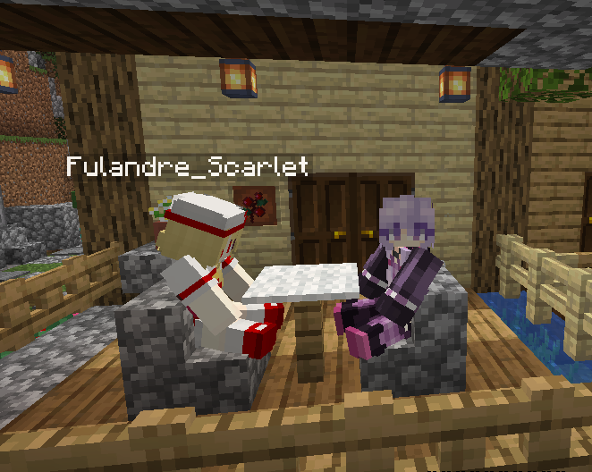

# SimpleCore

Make some chairs in Minecraft. *(Works on 1.15.2)*

## Screenshot



## Usage

Right click on any kind of **stairs** with **empty** main hand.

## Permission

- **simplechairs.cannotsit**: Prevent players from sitting on chairs.

## Build

```bash
git clone https://github.com/Apisium/SimpleCharis.git

gradlew jar
```

## Author

Shirasawa

## License

[MIT](./LICENSE)
